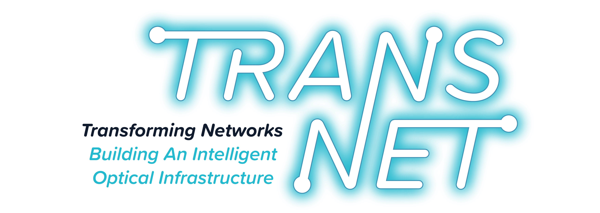

<h1>The ISRS GN model &emsp;&emsp;&emsp;&emsp;&emsp;&emsp;&emsp;&emsp;&emsp;&emsp;&emsp;&emsp;&emsp;</h1>&nbsp;

 
#### D. Semrau, E. Sillekens, R. I. Killey, P. Bayvel, Jan 2019
----
This repository provides helper functions and models for nonlinear performance prediction of ultra-wideband coherent optical communication systems. 

In particular, this repository provides an implementation of the Gaussian Noise (GN) model in the presence of inter-channel stimulated Raman scattering (ISRS) in closed-form. This enables real-time performance estimation in point-to-point as well as in mesh optical network transmission. The implementation is based on the results published in our paper:

> [1] D. Semrau, R. I. Killey, P. Bayvel, "[A Closed-Form Approximation of the Gaussian Noise Model in the Presence of Inter-Channel Stimulated Raman Scattering](https://ieeexplore.ieee.org/document/8625492), " J. Lighw. Technol., Early Access, DOI: 10.1109/JLT.2019.2895237, Jan. 2019.

## Content

The implementation of the ISRS GN model in closed-form can be found in the ISRS GN model function below, both in Matlab and in Python. 

To help readers apply the implementation, the example code below uses the ISRS GN model function to reproduce the results in [1]. For a full documentation of the required syntax, please see [here](Functions/ISRSGNmodel.md).
### ISRS GN model function

[ISRS GN model function in Matlab](Functions/Matlab/ISRSGNmodel.m)

[ISRS GN model function in Python](Functions/Python/ISRSGNmodel.py)

### Examples

#### Example code to reproduce results in [1]

[Example 1 code in Matlab](Examples/Matlab/Example1.m)

[Example 1 code in Python](Examples/Python/Example1.ipynb)

## License 
The code is &copy; D. Semrau, E. Sillekens, 2019, and it is made available under the MIT license enclosed with the software. 

Over and above the legal restrictions imposed by this license, if you use this software for an academic publication then you are obliged to provide proper attribution. This can be done to the paper that describes it, 

* D. Semrau, R. I. Killey, P. Bayvel, "A Closed-Form Approximation of the Gaussian Noise Model in the Presence of Inter-Channel Stimulated Raman Scattering, " J. Lighw. Technol., vol. xx, no. xx, DOI: [10.1109/JLT.2019.2895237](https://doi.org/10.1109/JLT.2019.2895237) , Jan. 2019. 

or to the code directly

* D. Semrau, E. Sillekens, R. I. Killey, P. Bayvel, "Implementation of the ISRS GN model, " v. 1.0 (2019). github.com/dsemrau/ISRSGN

or (ideally) both. 

## Further Reading 

1. D. Semrau, E. Sillekens, R. I. Killey and P. Bayvel, "[The ISRS GN Model, an Efficient Tool in Modeling Ultra-Wideband Transmission in Point-to-Point and Network Scenarios](https://ieeexplore.ieee.org/document/8535146)," in European Conference on Optical Communication (ECOC), Tu4G.6, DOI: 10.1109/ECOC.2018.8535146, Sep. 2018

2. D. Semrau, R. I. Killey, and P. Bayvel, “[The Gaussian Noise model in the presence of inter-channel stimulated Raman scattering](https://ieeexplore.ieee.org/document/8351897),” J. Lightw.
Technol., vol. 36, no. 14, DOI: 10.1109/JLT.2018.2830973, Jul. 2018

3. G. Saavedra, D. Semrau, M. Tan, M. A. Iqbal, D. J. Elson, L. Galdino,
P. Harper, R. I. Killey, and P. Bayvel, “[Inter-channel stimulated Raman
scattering and its impact in wideband transmission systems](https://ieeexplore.ieee.org/document/8386214),” in Optical
Fiber Communication Conference (OFC), Th1C.3, pp.1-3, Mar. 2018

4. D. Semrau, R. Killey, and P. Bayvel, “[Achievable rate degradation of
ultra-wideband coherent fiber communication systems due to stimulated
Raman scattering](https://www.osapublishing.org/oe/abstract.cfm?uri=oe-25-12-13024),” Opt. Express, vol. 25, no. 12, DOI: 10.1364/OE.25.013024,
Jun. 2017.

5. P. Poggiolini, “[The GN model of non-linear propagation in uncompensated
coherent optical systems](https://ieeexplore.ieee.org/document/6296670),” J. Lightw. Technol., vol. 30, no. 24, DOI: 10.1109/JLT.2012.2217729, Dec. 2012.
